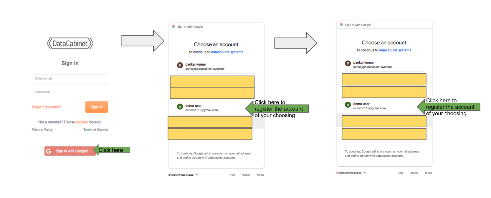
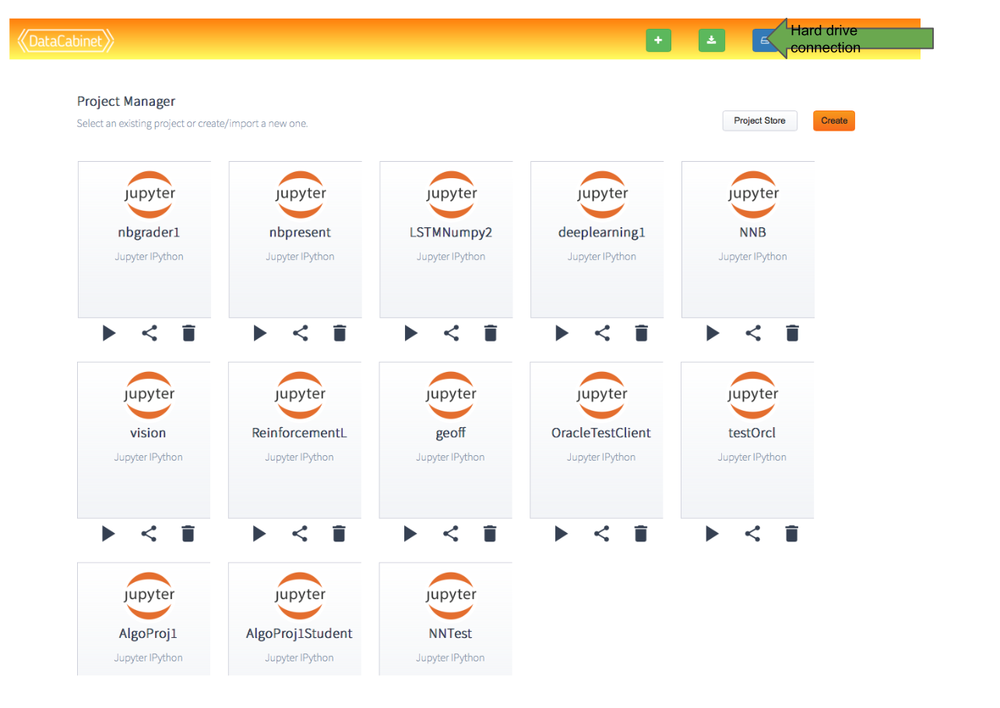
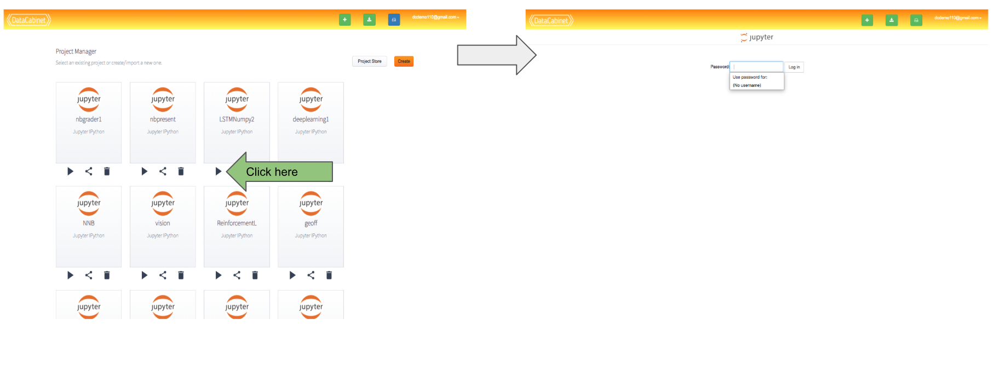
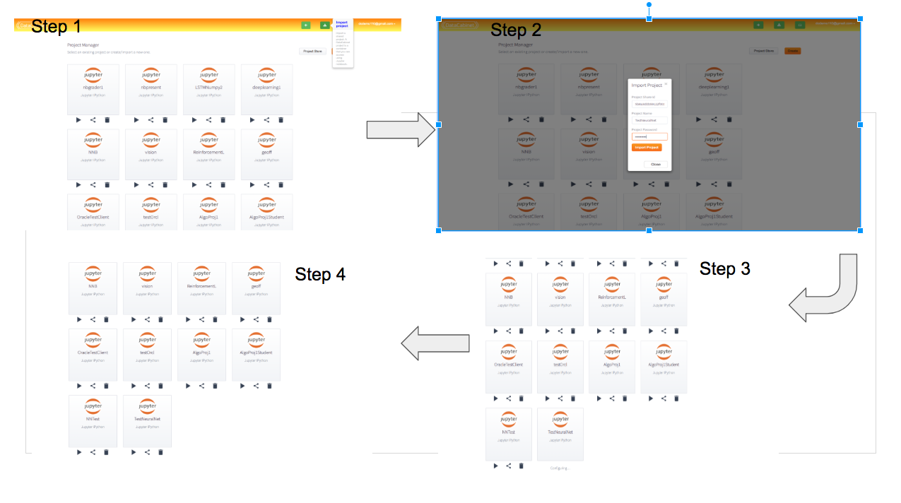
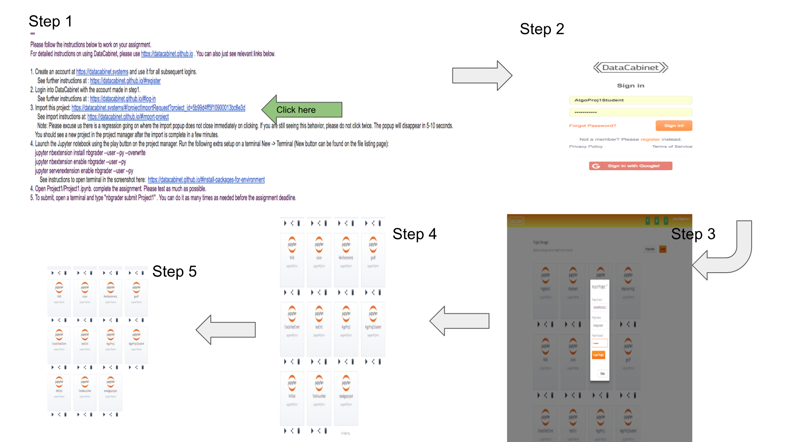

# DataCabinet

DataCabinet enables running computer laboratory for classrooms. It does it using Jupyter notebooks, conda environments and containers. It is powered by a distributed system running on AWS.

#### **Features**:
- Jupyter notebooks with support for python or R on your web browser. Other kernels can be manually installed.
- Isolated Conda environments with their own package dependencies as DataCabinet projects.
- A dedicated disk and a shared disk to easily share projects and environments.
- Integrated with NBGrader assignments with advanced capbilities [DataCabinet and NBGrader](#datacabinet-and-nbgrader)
- Using [git](#gitssh) projects with DataCabinet. 
- [Common Problems](#common-problems)

### Document sections
- [Get Started](#get-started)  
- [DataCabinet and NBGrader](#datacabinet-and-nbgrader)  
- [Examples](#examples)
- [Miscellaneous](#miscellaneous)

## **Get started**
- [Register](#register)  
- [Login](#log-in)  
- [Create Project](#create-project)  
- [Launch Project](#launch-project)  
- [Creating Notebooks](#creating-notebooks)  
- [Install packages](#install-packages-for-environment)  
- [Export Project](#export-project) 
- [Import Project](#import-project) 
- [Code](#code)  

### **Register**

#### Method 1: Using Google Account
You can register a datacabinet account using your Google account at  [datacabinet systems](http://datacabinet.systems/#/register). First time you login/register, it will take 5 minutes to provision your account after which you can login using the same method you registered.
 

 

#### Method 2: Directly on datacabinet
You can register your account at [datacabinet systems](http://datacabinet.systems/#/register). After registering, you will be sent an e-mail for verification after which your account would be ready to login.    
  

 

### **Log in**
Go to [datacabinet systems](http://datacabinet.systems/) to login. You can either login using your credentials with datacabinet or use your google account.

 

After login, your hard drive is not available if there is another session still running. You can force the hard drive to connect to your current session This button will remind you if you have another session going on: . It will disconnect the other session if you click it. When this button is green () - the hard drive is correctly attached to the current session.

You will need to enter an access code to be able to run Jupyter notebooks after your trial runs out.

### **Create project**

A DataCabinet project comprises of a set of user code files and one conda environment. The conda environment can have package dependencies (like tensorflow or keras), notebook extensions (nbgrader, nbpresent), language kernels for notebooks etc.

To add a project, first you need to sign-in using your credentials or google account. You have to choose a Project Name and a password. Our environments also have a default Python version. You can choose the one you like. For other languages, you have to install the corresponding Jupyter kernel. Most of them are available as pypi or conda packages. See install packages for details.   
  

 

### **Launch project**
Launching a notebook is easy. Just click the play button on project manager. It will prompt you for the password that was entered during project creation time(add or import).

 

### **Creating Notebooks**

Using Jupyter you can create lots of interesting stuff: from simple notebooks to math-heavy presentations and autograded assignments. To get started with Jupyter go to [Jupyter Notebook Basics](http://jupyter-notebook.readthedocs.io/en/latest/examples/Notebook/Notebook%20Basics.html).

You can also can install various language kernels and create notebooks in multiple languages.

To create a notebook, on the **Files** tab, click the **New** button.

### **Install packages for environment**

Every project you create in DataCabinet has a corresponding Conda environment with the same name as the project.

You can install additional packages for a project using either **conda install packagename** or **pip install packagename**.

>  In the Datacabinet platform, there are some installations that interfere with functioning and should not be pip installed(Jupyter, zmq etc). Sometimes these come as dependencies as well. For eg, the conda r-essentials package has Jupyter as a dependency. If somehow a wrong version of these packages is installed and Jupyter does not start, you may lose direct access to the project. It is a good idea to keep exporting your project at regular intervals so that you can retrieve the projects. Please write to us if you get into this situation and we can fix it. We are working on a way to fix it properly through versions.

A sample installation of a package **numpy** is highlighted below:  
  

### **Export Project**
Datacabinet allows you to export your project at any point. A common workflow of working on a project would be to create a project, write some code, install some packages and do some more initialization steps. At this point, we may want to export the package to share it with people. The export command is built for replicating the current state of your project to anyone.

Exporting a project exports the code(and other files) and the conda/pip packages. You can also write a script that can do further setup when a user imports the project. See more about this script in the import section.

Other users can import that project (using the share ID provided) and get a copy of the project exactly at the point the original user exported it.

You can share this ID with anyone, you want to share the project with.

To export a project, you need to login using your credentials or your google account. The next steps are mentioned below:   
  

### **Import Project**
Import project takes a project ID and does the following:
- Copies all the files
- Installs all packages
- IF there is a runnable file called import_init.sh in the base directory of the project, it runs that file.

There are two ways to import a project from someone else:
#### Method 1: Directly using the project id.
Get the id of the project from the sharer and use the import button. You will have to choose the name of the project and a password for the Jupyter notebook in Step 2. The import project button will be disabled until the hard drive is connected. 
*There is a regression currently where after clicking the "Import Project" button, the dialog does not close immidiately. Clicking twice will lead to error. Please wait after clicking for 20 seconds.*

 
 

#### Method 2: Using a link
Get the link of the project from the sharer and use the import button. You will have to choose the name of the project and a password for the Jupyter notebook in Step 3. Step 2 will not be required if you are already logged in. The import project button will be disabled until the hard drive is connected. 
*There is a regression currently where after clicking the "Import Project" button, the dialog does not close immidiately. Clicking twice will lead to error. Please wait after clicking for 20 seconds.*

 
 

### **Code**

When you finish writing code in the created file or just want to check current progress, just go to **Cell** &gt; **Run Cells**. The result will be displayed in the new dialog.

DataCabinet provides you with the space on the NFS share (2GB) which allows you to publish your code using unix authorization mechanisms.

## **DataCabinet and NBGrader**
DataCabinet provides you the backend to create and distribute programming assignments using nbgrader. You can create a populated assignment with both questions and answers and then nbgrader turns it into unpopulated version which contains only questions. Then you can share the assignments with students, auto grade and/or form grade assignment, and then distribute grades. Please find more documentation about nbgrader here: [jupyter nbgrader](http://nbgrader.readthedocs.io/en/stable/index.html)

### **For instructor**
**Prerequisite:** Install and configure nbgrader with DataCabinet:

1. Create and Open a new project.

2. Go to **New** > **Terminal**, and then install nbgrader. You need to type your own:

       pip install nbgrader
       jupyter nbextension install --user --overwrite --py nbgrader 
       jupyter nbextension enable --user --py nbgrader
       jupyter serverextension enable --user --py nbgrader

3. You might need to restart notebook or log out/log in again to see the changes. To restart the notebook, you will have to either logout/login or start another project and switch back to the current project. We are working on fixing this.

4. On terminal, Run the following command to create an empty configuration file:

        nbgrader --generate-config

5. Make a directory in Terminal and give everyone permission to it: 

        mkdir /mnt/nfs/<your email>/share 
        chmod 777 /mnt/nfs/<your email>/share

6. Open the nbgrader_config.py file that is generated through the jupyter console and put:

        c = get_config()
        c.Exchange.course_id = "<Project name>"
        c.Exchange.root = "/mnt/nfs/<your email>/share"
        c.ExecutePreprocessor.kernel_name = “<Project name>”

Please be careful there should be no spaces before these lines. You will have to restart notebook for exchange root to be setup properly.

**Create assignment (Original project):**

1. Go to **Formgrader** > **Add new assignment**

2. Open the folder that you just created and create a notebook. Open the notebook.

3. Go to **View** > **Cell Toolbar** > **Create Assignment**.

4. Add cells with content:

    1. Multiple cells with questions and tasks, each cell will have ID, points.

    2. Solution in a solution block and student is expected to fill it up 

    3. Assessment for you to grade answers

5. Save using File > Save and Checkpoint

**Release assignment:**

Go to **Formgrader** > Click **Generate** > Click **Release**

After releasing, instructors will have to create a student version of the assignment(explained in the next section: Create student version)

**Collect & Grade assignment:**

1. Go to **Formgrader** > Click **Collect**

2. click the digits under Submissions

3. click the mark under Autograde and see the solutions.

**Create student version**

Repeat Step 1 to Step 4 on **For Instructor** -> **Pre-Requisite** . Choose a different project name silly.

Next, open the nbgrader_config.py file that is generated through the jupyter console and put:

        c = get_config()
        c.Exchange.course_id = "<Project name>"
        c.Exchange.root = "/mnt/nfs/<instructor email>/share"

Notice that \<Project Name\> is the course_id project created in the instructor version and instructor email is instructor's email where the project was shared. WE can also install any other data or packages that are required to run the project at this point.

Next, we share this project using DataCabinet Project Manager's share icon. That would give you the ID of the project. This ID can be shared with the student directly or as an http link: https://datacabinet.systems/#/projectImportRequest?project_id=\<ID\>

## Integration with LMS ##

We provide integration with most popular lms system like Canvas, Blackboard, Moodle, Open EdEx. You can synchronize students' assignments grades with any of these platforms.

### Requirements ###

* Students' e-mails on Nbgrader are identical with students' e-mails on lms system
* Assignments names on Nbgrader are identical with assignments names on lms system
* You must be an course instructor on lms system
* You must have API access on lms system

### Integration with Canvas ###

 **Getting api token**
 
Go to your profile settings page and at the bottom click the button that says "New Access Token". You can use this access token to synchronize grades with Nbgrader

 **Usage**
 
Go to nbgrader home '/tree' and open nbgrader_config.py. Type next strings:
      
      c.CourseDirectory.canvas_token = 'Your canvas api token'  # string
      c.CourseDirectory.canvas_account_id = 'Your canvas account id'  # string
      c.CourseDirectory.canvas_course_id = 'Your canvas course id'  # string

Then save the file. In Nbgrader assignments manager click synchronize button with assignment name near your assignment.

### Integration with BlackBoard ###

**Getting api token**

 Register new app on https://developer.blackboard.com then, contact with your blackboard portal administrator to accept your app
       
**Usage**
 
Go to nbgrader home '/tree' and open nbgrader_config.py. Type the following strings:
      
      c.CourseDirectory.blackboard_app_key = 'Your BlackBoard app key'  # string
      c.CourseDirectory.blackboard_app_secret = 'Your BlackBoard app secret'  # string
      c.CourseDirectory.blackboard_learn_domain = 'Domain of BlackBoard your blackboard portal'  # for example 'http://my.blackboard.com' 
      c.CourseDirectory.blackboard_course_id = 'Your BlackBoard course id'  # string

Then save the file. In Nbgrader assignment manager click synchronize button with assignment name near your assignment.
 
### Integration with Moodle ###

**Getting api token**

Contact with your Moodle portal administrator to get access token 

**Usage**
 
Go to nbgrader home '/tree' and open nbgrader_config.py. Type the following strings:
      
      c.CourseDirectory.moodle_app_key = 'Your access Moodle torken'  # string
      c.CourseDirectory.moodle_domain = 'Your Moodle domain'  # for example 'http://mymoodle.com' 
      c.CourseDirectory.moodle_course_id = 'Your Moodle course id'  # string

Then save the file. In Nbgrader assignment manager click synchronize button with assignment name near your assignment.

## For Student Users

To access assignments, students needs to import a course with the ID generated in the previous step (or by clicking the link). After import, you have the run the project, open a terminal and enable nbgrader:

       jupyter nbextension install --user --overwrite --py nbgrader 
       jupyter nbextension enable --user --py nbgrader
       jupyter serverextension enable --user --py nbgrader

To get assignment, you need to click “fetch” first in **Assignents** and open the assignment. After you finish the assignment, you just can click submit.

***Keep in mind that you may need to log out and in the account after you install nbgrader.**

***When you create a new notebook, you have to choose the same name as the project’s name under “New”.**

## **Examples**
You can use DataCabinet to create a number of complex assignments with various dependencies. Students can work on the assignments with almost zero setup.

- [DeepLearning](#deep-learning) 
- [C++ with NBGrader](#c++-with-nbgrader) 
- [SQL with NBGrader](#sql-with-nbgrader)  
- [R with NBGrader](#r-with-nbgrader)  

### **Deep Learning**
### **C++ with NBGrader**
### **SQL with NBGrader**
### **R with NBGrader**

## **Miscellaneous**

### **NBPresent** 

Using DataCabinet, you can create presentations in the Jupyter notebook.

Jupyter notebook allows you to mix your presentations with runnable code, mathematical notation and latex symbols using MathJax.

**Prerequisite:** install the nbpresent extension. In the needed project, go to **New** > **Terminal**, and then execute command:

        pip install nbpresent
        jupyter nbextension install nbpresent --user --py --overwrite
        jupyter nbextension enable nbpresent --user --py
        jupyter serverextension enable nbpresent --user --py

Then go to the needed notebook. In the tool menu you have new buttons

 that allow creating and showing the presentation.

1. Open the needed project and notebook.

2. Go to View > Cell toolbar > Slideshow.

3. In the Slide type drop-down list, select Slide.

4. Go to Cell > Cell type, and select the needed option (Code, Markdown, and …) and enter content for your presentation.

Add as many slides as you need, using … (… button).

5. On the top menu, click the Edit presentation button. 

6. On the right panel, click Slides/Present.

7. Remove any slides already present by clicking the -Slide a number of times.

8. Choose either Basic or RISE/reveal slide format. After choosing the format, press escape or press the notebook button to get back to the notebook.

9. Now you can use the present button to present. 

10. Tip: To see the source of the slide during the presentation, double-click a slide. To go back, press Ctrl + Enter.

**[Marketing/Landing Page:](http://datacabinet.info) **

### **GitSsh**
The default key resides in the directory /mnt/ebs/\<email\>/.ssh directory.
If you put the public key on your git provider, you will be able to access git and ssh.

### **Common Problems**
1. My new projects do not take password
It is possible your conda cache is corrupted. `conda clean --index-cache`
