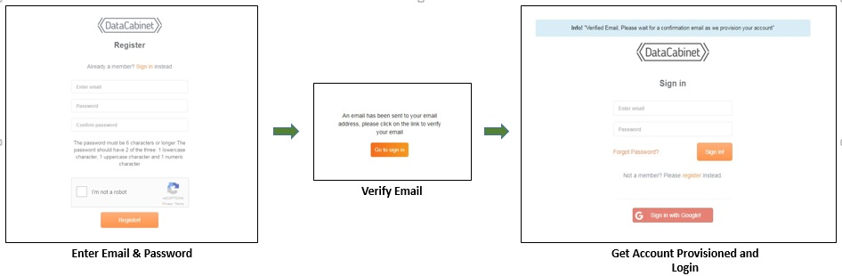
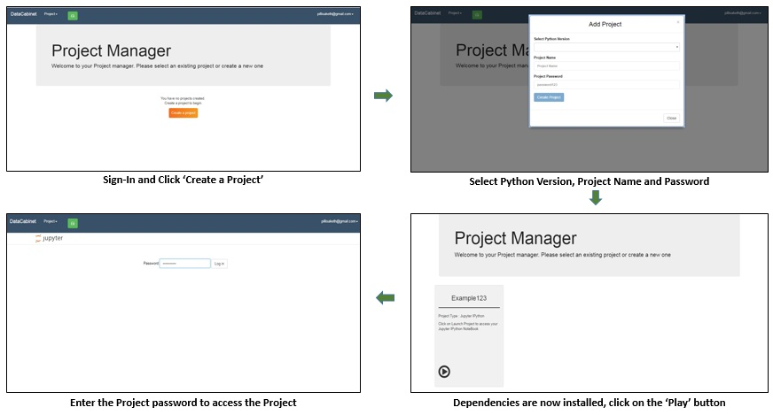
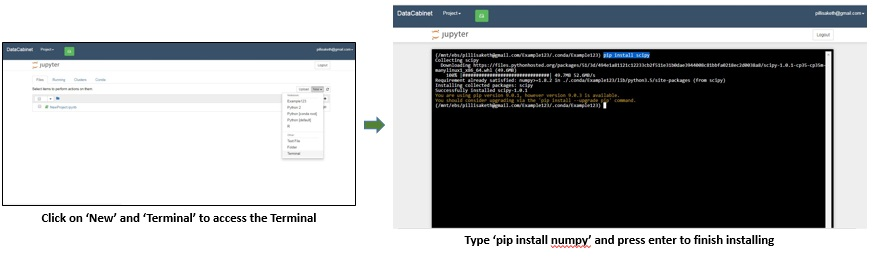
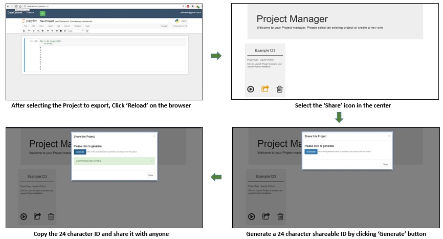
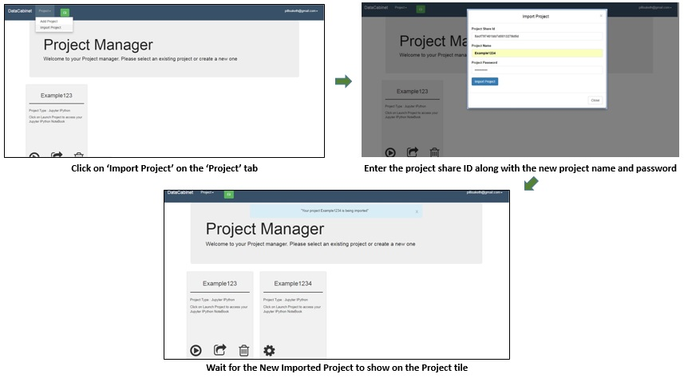

# DataCabinet

DataCabinet is an online platform to maintain your Jupyter notebooks and conda environments. It is powered by a distributed system running on AWS.

#### **Features**:
- Jupyter notebooks with support for python or R on your web browser. Other kernels can be manually installed.
- Isolated Conda environments with their own package dependencies as DataCabinet projects.
- A dedicated disk and a shared disk to easily share projects and environments.

## **Get started**
- [Register](#register)  
- [Login](#log-in)  
- [Create Project](#create-project)  
- [Install packages](#install-packages-for-environment)  
- [Export Project](#export-project) 
- [Import Project](#import-project) 
- [Code](#code)  

## **Register**

You can register your account at [datacabinet systems](http://datacabinet.systems/#/register). After registering, you will be sent an e-mail for verification after which your account would be ready to login.    
  

 

## **Log in**
Go to [datacabinet systems](http://datacabinet.systems/) to login. You can either login using your credentials or use your google account.

* Normal Login Screenshots
* Google Login Screenshots

## **Create project**

A DataCabinet project comprises of a set of user code files and one conda environment. The conda environment can have package dependencies (like tensorflow or keras), notebook extensions (nbgrader, nbpresent), language kernels for notebooks etc.

To add a project, first you need to sign-in using your credentials or google account.   
  

 

## **Install packages for environment**

Every project you create in DataCabinet has a corresponding Conda environment with the same name as the project.

You can install additional packages for a project using either **conda install packagename** or **pip install packagename**.

>  In the Datacabinet platform, there are some installations that interfere with functioning and should not be pip installed. A list of these are - TBD 

A sample installation of a package **numpy** is highlighted below:  
  

# **Jupyter Notebooks & Project Sharing**

## **Creating Notebooks**

Using Jupyter you can create lots of interesting stuff: from simple notebooks to math-heavy presentations and autograded assignments. To get started with Jupyter go to [Jupyter Notebook Basics](http://jupyter-notebook.readthedocs.io/en/latest/examples/Notebook/Notebook%20Basics.html).

You can also can install various language kernels and create notebooks in multiple languages.

To create a notebook, on the **Files** tab, click the **New** button.

## **Export Project**
Datacabinet allows you to export your project at any point. A common example would be to provision a project by installing a set of packages, writing some code in notebooks and then exporting it. Other users can import that project (using the share ID provided) and get a copy of the project exactly at the point the original user exported it.

You can share this ID with anyone, you want to share the project with.

To export a project, you need to login using your credentials or your google account. The next steps are mentioned below:   
  

## **Import Project**

To import a project, you need to login using your credentials or your google account. The next steps needed to import a project are highlighted below-   
  

 

## **Code**

When you finish writing code in the created file or just want to check current progress, just go to **Cell** &gt; **Run Cells**. The result will be displayed in the new dialog.

DataCabinet provides you with the space on the NFS share (2GB) which allows you to publish your code using unix authorization mechanisms.

## **NBGrader**
DataCabinet provides you the backend to create and distribute programming assignments using nbgrader. You can create a populated assignment with both questions and answers and then nbgrader turns it into unpopulated version which contains only questions. Then you can share the assignments with students, auto grade and/or form grade assignment, and then distribute grades. Please find more documentation about nbgrader here: http://nbgrader.readthedocs.io/en/stable/index.html 

**Prerequisite:** Install and configure nbgrader with DataCabinet:

1. Open the needed project.

2. Go to **New** > **Terminal**, and then install nbgrader:

       pip install nbgrader
       jupyter nbextension install --user --py nbgrader --overwrite
       jupyter nbextension enable --user --py nbgrader
       jupyter serverextension enable --user --py nbgrader

3. You might need to restart notebook or log out/log in again to see the changes.

4. On terminal, Run the following command to create an empty configuration file:

        nbgrader --generate-config

5. Make a directory in the nfs drive and give everyone permission to it: 

        mkdir /mnt/nfs/<your email>/share 
        chmod 777 /mnt/nfs/<your email>/share

6. Open the nbgrader_config.py file that is generated through the jupyter console and put:

        c = get_config()
        c.NbGrader.course_id = "<course id>"
        c.TransferApp.exchange_directory = "/mnt/nfs/<your email>/share/<coursename>"

**Create assignment:**

1. Open the needed project and notebook.

2. Go to View > Cell Toolbar > Create Assignment.

3. Add cells with content:

    1. Multiple cells with questions and tasks, each cell will have ID, points.

    2. Solution in a solution block and student is expected to fill it up 

    3. Assessment for you to grade answers

4. Save using File > Save and Checkpoint

5. Assign to students – in the New > Terminal execute "nbgrader assign chapter0". It create a notebook with assignment for students.

Note: If you attempt assigning to students, and new file is not created, use dash force command. This command removes the existing file and creates new one for new version.

6. To release assignment, in Terminal, execute command "nbgrader release --force chapter0 ".

You students need to know how to access release shared directory.

Useful commands in nbgrader (See more info on nbgrader docs):

* Create assignment by putting the assignment notebooks in proper directory structure

* Add assignment to database – "nbgrader assignment add chapter0"

* Add a student to database – "nbgrader db student add [name]"

You can also list all needed students – "nbgrader db student list [name]"

* nbgrader assign chapter0 

* nbgrader release chapter0

**For student users**

To access assignments, student needs to install nbgrader extention. Follow the same instructions as the instructors. Only difference is that the course id and transfer directory needs to be that of the instructor:

    c = get_config()
    c.NbGrader.course_id = "<course id>"
    c.TransferApp.exchange_directory = "/mnt/nfs/<instructor email>/share/<coursename>"

To get the assignment, in Terminal, do "nbgrader fetch chapter0".

When you finish assignment, in Terminal, do "nbgrader validate chapter0".

## **NBPresent** 

Using DataCabinet, you can create presentations in the Jupyter notebook.

Jupyter notebook allows you to mix your presentations with runnable code, mathematical notation and latex symbols using MathJax.

**Prerequisite:** install the nbpresent extension. In the needed project, go to **New** > **Terminal**, and then execute command:

        pip install nbpresent
        jupyter nbextension install nbpresent --user --py --overwrite
        jupyter nbextension enable nbpresent --user --py
        jupyter serverextension enable nbpresent --user --py

Then go to the needed notebook. In the tool menu you have new buttons

 that allow creating and showing the presentation.

1. Open the needed project and notebook.

2. Go to View > Cell toolbar > Slideshow.

3. In the Slide type drop-down list, select Slide.

4. Go to Cell > Cell type, and select the needed option (Code, Markdown, and …) and enter content for your presentation.

Add as many slides as you need, using … (… button).

5. On the top menu, click the Edit presentation button. 

6. On the right panel, click Slides/Present.

7. Remove any slides already present by clicking the -Slide a number of times.

8. Choose either Basic or RISE/reveal slide format. After choosing the format, press escape or press the notebook button to get back to the notebook.

9. Now you can use the present button to present. 

10. Tip: To see the source of the slide during the presentation, double-click a slide. To go back, press Ctrl + Enter.

**[Marketing/Landing Page:](http://datacabinet.info) **

## **GitSsh**
The default key resides in the directory /mnt/ebs/\<email\>/.ssh directory.
If you put the public key on your git provider, you will be able to access git and ssh.

## **Common Problems**
1. My new projects do not take password
It is possible your conda cache is corrupted. `conda clean --index-cache`

  
